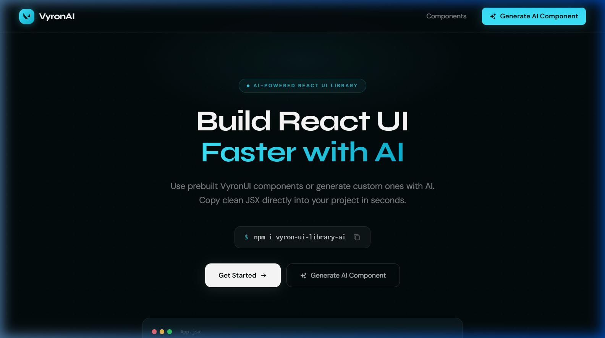
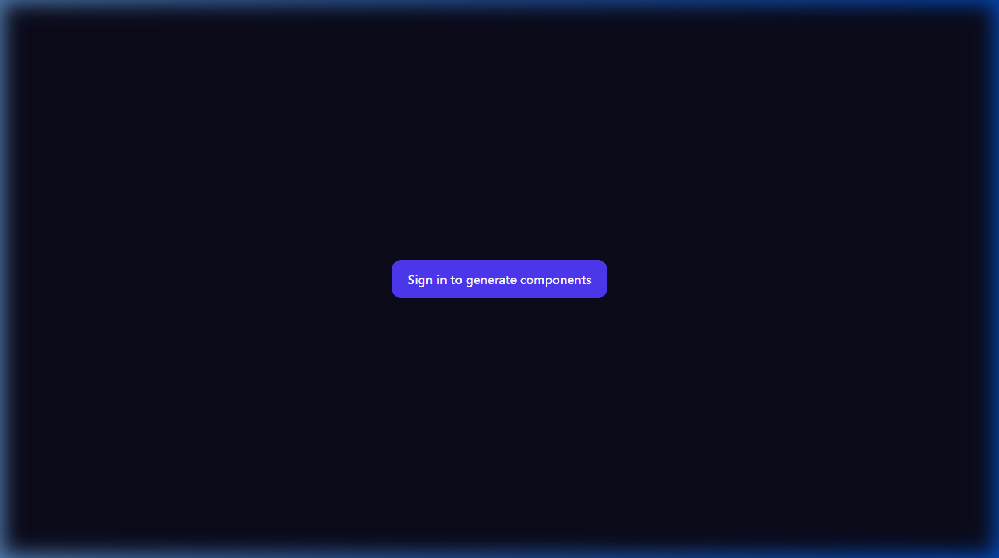
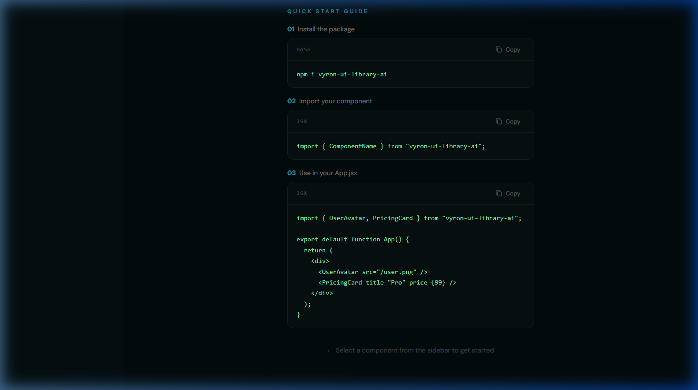
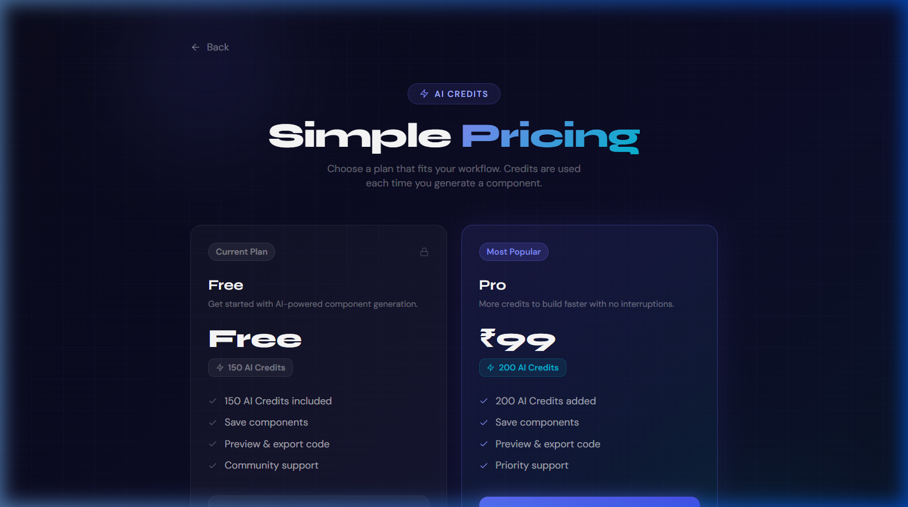

<div align="center">

# 🚀 VyronAI: Full-Stack AI-Powered React UI Component Platform
**Generate, Preview, Customise, and Publish React UI Components with the Power of DeepSeek V3.**

[](https://reactjs.org/)
[](https://vitejs.dev/)
[](https://nodejs.org/)
[](https://expressjs.com/)
[](https://mongodb.com/)
[](https://tailwindcss.com/)
[](#license)

[**Live Demo (Coming Soon)**](#) • [**Report Bug**](#bug-detection--known-issues) • [**Request Feature**](#future-improvements)

</div>

---

## 💡 About The Project

VyronAI is a comprehensive, full-stack SaaS platform designed to revolutionise how developers build UI. It combines a robust pre-built React component library (`vyron-ui-library-ai` on npm) with a powerful AI generator powered by DeepSeek V3 via OpenRouter. 

Users can effortlessly describe their desired UI in plain English, and VyronAI instantly generates production-ready, interactive JSX components. These components can be previewed live, customised, saved, and seamlessly integrated into any React project.

### 📸 Preview / Screenshots

| **Landing Page** | **Component Generator** |
| :---: | :---: |
|  |  |
| **Component Library** | **Pricing Plans** |
|  |  |
| **AI Generation Process** | |
|  | |

---

## ✨ Core Features

- 🤖 **AI-Powered Generation:** Turn plain English prompts into functional React JSX components using DeepSeek V3.
- ⚡ **Live Interactive Preview:** Real-time sandboxed execution and preview using `react-live` and `@codesandbox/sandpack-react`.
- 🎨 **Rich Component Library:** Browse and use 25+ prebuilt, highly polished glassmorphism-styled components out of the box.
- 💳 **Integrated Monetisation:** Secure, frictionless AI credit purchasing via **Razorpay** integration.
- 🔐 **Authentication:** Google OAuth via **Firebase** paired with secure JWT-based, HTTP-only cookies.
- 📦 **One-Click npm Publishing:** Admin dashboard with an automated pipeline to build (`tsup`) and publish directly to the npm registry.
- 🌓 **Premium UI/UX:** Dark glassmorphism aesthetic, radial gradient glows, and fluid `framer-motion` animations.

---

## 🛠️ Tech Stack

### **Frontend (`vyron-ui-client`)**
* **Core:** React 19, Vite 7
* **Styling:** TailwindCSS v4
* **State Management:** Redux Toolkit (`@reduxjs/toolkit`)
* **Routing:** React Router v7
* **Animations:** Framer Motion
* **Utilities:** Axios, React Icons, Recharts

### **Backend (`vyron-ui-server`)**
* **Core:** Node.js (>=18), Express.js v5 (ESM)
* **Database:** MongoDB, Mongoose 9
* **Authentication:** Firebase (Client), JWT + HTTP-Only Cookies (Server)
* **Payments:** Razorpay Node SDK
* **AI Provider:** OpenRouter API (DeepSeek V3 Model)

### **Component Library (`vyron-ui-lib`)**
* **Bundler:** `tsup` (Dual CJS/ESM bundling)
* **Type System:** TypeScript

---

## 🏗️ Project Architecture & Flow

1. **User Authentication:** Client uses Firebase Google OAuth to get a provider token -> sends to Node backend `/api/auth/googlesignup` -> Backend verifies and issues a secure HTTP-Only JWT.
2. **AI Generation Flow:** User inputs a prompt -> Frontend deducts 50 local credits (optimistic UI) -> Sends request to `/api/component/generate` -> Backend validates JWT, deducts credits from DB, calls OpenRouter (DeepSeek V3) enforcing JSON output -> Backend returns raw React JSX code to the frontend -> Frontend renders it safely via `react-live`.
3. **Admin Publish Pipeline:** Admin clicks "Publish" -> Backend creates `.jsx` file in `vyron-ui-lib` -> Updates `index.js` -> Runs `npm run build` -> Increments package version -> Executes `npm publish` synchronously to the global registry.

---

## 📂 Folder Structure

```text
d:\VyronUI\vyron-ui\
├── vyron-ui-client/          # React Vite Frontend Application
│   ├── src/                  # Components, Pages, Redux store, utils
│   ├── public/               # Static assets
│   ├── package.json          # Client dependencies
│   ├── vite.config.js        # Vite & Tailwind configuration
│   └── eslint.config.js      # Linting rules
│
├── vyron-ui-server/          # Node.js Express Backend
│   ├── configs/              # DB connection & external service config
│   ├── controllers/          # Business logic (Auth, Component, Payment)
│   ├── middlewares/          # isAuth.js (JWT validation)
│   ├── models/               # Mongoose schemas (User, Component, Payment)
│   ├── routes/               # Express routing
│   ├── utils/                # Helper functions
│   └── index.js              # Server entry point
│
├── vyron-ui-lib/             # Publishable NPM Component Library
│   ├── src/                  # Core React components (25+ items)
│   ├── dist/                 # tsup build output (CJS & ESM)
│   ├── tsup.config.js        # Bundler configuration
│   └── package.json          # Library dependencies
│
└── requirements.txt          # Master project specification
```

---

## 🚀 Installation & Setup

Follow these steps to set up the project locally.

**Prerequisites:** Node.js >= 18.x, MongoDB >= 6.x

### 1. Clone & Install Dependencies
```bash
# Clone the repository
git clone <your-repo-url>
cd VyronUI/vyron-ui

# Install Client Dependencies
cd vyron-ui-client
npm install
npm install framer-motion # Fixes known dependency issue

# Install Server Dependencies
cd ../vyron-ui-server
npm install

# Install Library Dependencies
cd ../vyron-ui-lib
npm install
```

### 2. Configure Environment Variables
You need to populate `.env` files in both the client and server directories. Refer to the [Environment Variables](#-environment-variables) section below.

### 3. Start Development Servers

Open two terminals:

**Terminal 1 (Backend):**
```bash
cd vyron-ui-server
npm run dev
# Runs on http://localhost:8000
```

**Terminal 2 (Frontend):**
```bash
cd vyron-ui-client
npm run dev
# Runs on http://localhost:5173
```

---

## 🔐 Environment Variables

Create a `.env` file in the respective directories.

**`vyron-ui-client/.env`**
```env
VITE_FIREBASE_APIKEY=your_firebase_web_api_key
VITE_RAZORPAY_KEY_ID=your_razorpay_publishable_key
```

**`vyron-ui-server/.env`**
```env
PORT=8000
MONGODB_URL=mongodb+srv://<user>:<password>@cluster.mongodb.net/vyron-ui
JWT_SECRET=your_super_secret_jwt_key
OPENROUTER_API_KEY=sk-or-v1-your_openrouter_api_key
RAZORPAY_KEY_ID=rzp_test_your_razorpay_key_id
RAZORPAY_KEY_SECRET=your_razorpay_key_secret
CLIENT_URL=http://localhost:5173
```

---

## 📖 Usage Guide

1. **Sign Up/Login:** Click the login button to authenticate via Google.
2. **Browse Components:** Navigate to `/component` to view the prebuilt library items.
3. **Generate UI:** Go to `/generate`. Enter a prompt (e.g., "Create a dark-themed pricing card with a cyan glow"). It costs 50 credits.
4. **Preview & Edit:** Use the live editor sandbox to tweak the generated JSX code or modify props.
5. **Buy Credits:** Go to `/pricing` to purchase more AI credits securely via Razorpay.
6. *(Admin Only)* **Publish:** Head to `/admin` to view user stats or push saved components directly to the public `vyron-ui-library-ai` npm registry.

---

## 📡 API Endpoints

| Method | Endpoint | Description | Auth Required |
| :--- | :--- | :--- | :---: |
| **POST** | `/api/auth/googlesignup` | Handles Firebase token, creates user, sets JWT cookie | ❌ |
| **GET** | `/api/auth/logout` | Clears JWT authentication cookie | ❌ |
| **GET** | `/api/user/currentuser` | Retrieves current logged-in user profile | ✅ |
| **POST** | `/api/component/generate`| Triggers DeepSeek AI to generate a component (-50 credits) | ✅ |
| **POST** | `/api/component/save` | Saves a component to the user's database | ✅ |
| **POST** | `/api/component/publish` | Builds and publishes component to npm (Admin Only) | ✅ |
| **POST** | `/api/payment/create-order`| Initializes a Razorpay order | ✅ |
| **POST** | `/api/payment/verify` | Verifies Razorpay signature and adds AI credits | ✅ |

---

## 🗄️ Database Schema

### `User` Collection
- `name` (String, Required)
- `email` (String, Required, Unique)
- `role` (String, Enum: `["user", "admin"]`, Default: `"user"`)
- `aiCredits` (Number, Default: `150`)

### `Component` Collection
- `name` (String)
- `code` (String, Full React JSX Code)
- `props` ([String], Customizable prop names)
- `owner` (ObjectId -> Ref: User)
- `visibility` (String, Enum: `["private", "public"]`, Default: `"private"`)
- `npmPackage` (String, set to `"vyron-ui-library"` upon publish)

---

## 🚨 Bug Detection & Known Issues

> [!WARNING]
> **Action Required to Run the App Seamlessly**

1. **`framer-motion` Dependency Conflict:** `package.json` specifies `"motion": "^12.35.2"`, but source files import from `"framer-motion"`. **Fix:** Ensure you run `npm install framer-motion` inside `vyron-ui-client`.
2. **Missing `.env` Credentials:** Authentication will silently fail without a valid `VITE_FIREBASE_APIKEY`. The server will crash or fail API calls without valid MongoDB, OpenRouter, and Razorpay keys. 
3. **NPM Library Naming Inconsistency:** The client package JSON points to `vyron-ui-library-ai` but the project specs sometimes refer to `vyron-ui-lib`. Standardise the npm registry name to avoid missing dependency errors.
4. **Synchronous Publishing:** The admin publish pipeline currently runs synchronously on the Node.js main thread (`execSync`). **Fix:** This should be moved to an asynchronous job queue (like BullMQ or Agenda) to prevent HTTP request timeouts during the build/publish phase.

---

## 🧗 Challenges Faced & Solutions

* **Challenge:** Executing AI-generated React code safely in the browser.
  * **Solution:** Implemented `@codesandbox/sandpack-react` and `react-live` to create secure, isolated browser environments that compile JSX on the fly without crashing the main application.
* **Challenge:** Ensuring the AI strictly outputs usable code without conversational filler.
  * **Solution:** Configured the OpenRouter API call to force `{ type: "json_object" }` responses and crafted a highly specific system prompt enforcing standalone, inline-styled React components.

---

## 🔮 Future Improvements

- [ ] **Async Build Pipeline:** Offload the npm `tsup` build and publish commands to a background worker to prevent server blocking.
- [ ] **Component Versioning:** Allow users to revert to previous versions of their AI-generated components.
- [ ] **Tailwind Support in AI:** Train/prompt the AI to generate components using Tailwind utility classes alongside inline styles.
- [ ] **Export to CodeSandbox/StackBlitz:** Add a 1-click button to export generated components directly to external IDEs.

---

## 🤝 Contribution Guide

Contributions are what make the open-source community such an amazing place to learn, inspire, and create. Any contributions you make are **greatly appreciated**.

1. Fork the Project
2. Create your Feature Branch (`git checkout -b feature/AmazingFeature`)
3. Commit your Changes (`git commit -m 'Add some AmazingFeature'`)
4. Push to the Branch (`git push origin feature/AmazingFeature`)

---

## 📄 License

Distributed under the ISC License. See `LICENSE` for more information.

---

## 👨‍💻 Author

**Aditya**  
*Full-Stack Engineer*
